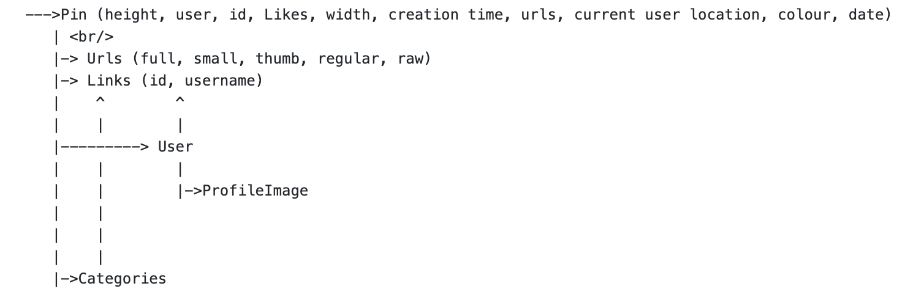

# PinBoardManager

The following link used for loading data:  
[http://pastebin.com/raw/wgkJgazE](url)  
Above download link is configurable and can be set in PinsViewModel as `urlstring` parameter.

Images link, Likes, time of creation  and JSON is cached in-memory only for all Pin items.

The classes in model are structured as follows:-
 

Cache size can be configured using class CacheConfiguration parameter `maxItems`

**** <b> Cache default duration can be set using `duration` in same class CacheConfiguration </b>

Downloading Libraries are structured as follows

    `DownloadManager`-->`CacheManager`

The items are removed from cache based on number of times the object was requested and in case of same number of requests most recent item is kept while others are removed

**** <b> An image load may be cancelled using method `cancelDownload` defined in class `Downloader` </b>

In case of a pin/url being requested by multiple sources simultaneously (even before it has loaded) the number of times
the pin was requested is incremented by 1 and this place a crucical role in deciding which item to remove from cached

## Integration of Library

For the following project I make use of SwiftyJSON as a dependancy for Decoding JSON object and assigning members in model classes.

Build the Workspace with target selected as PinBoardFramework to get the framework generated as output in same directory.

Add SwiftyJSON and PinBoardManager.framework generated to you linked framework and Libraries along with Embeded binaries and import the frameworks in your source to make use of library. (add framework in target you are building)  
`import PinBoardManager`  
`import SwiftyJSON`

### **For demonstration purpose TestApplication has been added which makes use of the generated framework and SwiftyJSON to fetch pin and display username and profile image in a table view.**
